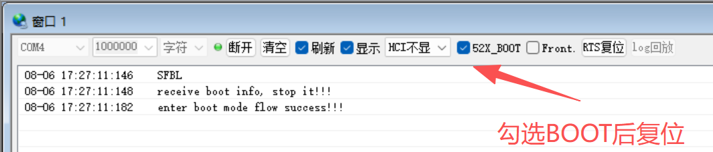

# SF32LB52x 自检指南

:::{attention}
本文档用于SF32LB52x系列芯片的硬件设计自检。在完成硬件设计后，请参照本文档逐项检查，确保硬件设计符合规范要求。
阅读前请确保已完成：
[硬件设计指南](/hardware/SF32LB52B-E-G-J-HW-Application)&nbsp;&nbsp;
[硬件设计自检查列表](<https://downloads.sifli.com/hardware/files/documentation/SF32LB52%20Schematic%26PCB%20checklist_V1.0_20260121.xlsx>)
:::

## 基本介绍

本文档为SF32LB52x系列芯片的硬件自检指南，适用于后缀为数字0、3、5、7的芯片（锂电池供电版本）以及后缀为字母B、E、J的芯片（3.3V/1.8V供电版本）。

本文档面向已经完成打样并返板的 SF32LB52x 硬件。重点不是再检查设计方案，而是通过实测点位、示波器、万用表和串口，确认板子在上电、下载、通信和使用过程中是否具备稳定工作能力。

:::{important}
**供电前须确认你所使用的芯片版本对应的供电方式：**

- **锂电池供电版本（0/3/5/7）**：必须接入外部锂电池（VBAT/VCC），否则设备无法正常运行。VBAT 和 VCC 是系统主电源，片内集成充电管理模块，支持 USB 充电。即使使用 USB 供电（VBUS），也需要电池连接在 VBAT 上，系统才能稳定工作。
- **常规供电版本（B/E/J）**：无需外部电池，通过 PVDD 引脚接入 2.97V ~ 3.63V 外部电源即可（52D 为 1.71V ~ 1.98V）。片内无充电管理模块，不支持充电功能。
  :::

### 建议工具

- 万用表：用于测量供电电压、测试点电压和短路情况
- 示波器：用于观察时钟波形、纹波和上电瞬态
- USB 数据线、串口工具
- 备用电源、可替换电池或充电器

### 测试条件

- 板子上电前先确认无明显短路、无反接、无焊接飞边或桥接
- 测试前先确认测试点是否已经留出并可访问
- 先做静态测量，再做动态上电和通信测试

## 一. 上电前检查

先进行目测和简单电气检查，避免在上电后再去追查明显问题。

- 检查关键器件是否缺件、反装、虚焊或明显短路
- 确认电源输入接口、充电口和电池接口方向正确
- 确认关键测试点（VBUS、VBAT、VCC、PVDD、BUCK_LX、BUCK_FB 等）已留出且可测
- 确认复位、下载和调试引脚没有被外设误拉低或误拉高

## 二. 供电与上电自检

上电后，应先确认主供电是否正常，再看内部 LDO/PMU 输出是否符合预期。建议按“输入→中间节点→负载端”的顺序测量。

### 2.1 供电电压检测表

| 系列           | 测试点            | 上电前/无负载时 | 正常工作时                               | 说明                                                         |
| :------------- | :---------------- | :-------------- | :--------------------------------------- | :----------------------------------------------------------- |
| 全系列通用     | BUCK_LX / BUCK_FB | 0V 或约 1.25V   | 约 1.25V                                 | 片内 DC-DC 输出/反馈，全系列均有                             |
| 全系列通用     | VDD_VOUT1         | 0V              | 约 1.1V                                  | 片内 LDO 输出，全系列均有                                    |
| 全系列通用     | VDD_VOUT2         | 0V              | 约 0.9V                                  | 片内 LDO 输出，全系列均有                                    |
| 全系列通用     | VDD_RET           | 0V              | 约 0.9V                                  | 片内 LDO 输出，全系列均有                                    |
| 全系列通用     | VDD_RTC           | 0V              | 约 1.1V                                  | 片内 RTC LDO 输出，全系列均有                                |
| 全系列通用     | AVDD33            | 0V              | 约 3.3V                                  | 3.3V 模拟电源，全系列均有                                    |
| 全系列通用     | AVDD33_AUD        | 0V              | 约 3.3V                                  | 3.3V 音频电源，全系列均有                                    |
| 全系列通用     | AVDD_BRF          | 0V              | 约 3.3V                                  | 3.3V 射频电源，全系列均有                                    |
| 全系列通用     | MIC_BIAS          | 0V              | 约 1.4V ~ 2.8V                           | 麦克风偏置电源输出，全系列均有                               |
| 锂电池供电版本 | VBUS              | 0V 或约 5V      | 4.6V ~ 5.5V                              | USB 充电输入（0/3/5/7）                                      |
| 锂电池供电版本 | VBAT              | 约电池电压      | 3.2V ~ 4.7V                              | 电池供电节点（0/3/5/7）                                      |
| 锂电池供电版本 | VCC               | 约电池电压      | 3.2V ~ 4.7V                              | 系统主电源（0/3/5/7）                                        |
| 锂电池供电版本 | VSYS              | 0V 或约 3.3V    | 约 3.3V                                  | 射频供电输出（0/3/5/7）                                      |
| 锂电池供电版本 | VDD18_VOUT        | 0V              | 约 1.8V                                  | SIP 供电输出，固定 1.8V（0/3/5/7）                           |
| 锂电池供电版本 | VDD33_VOUT1       | 0V              | 约 3.3V                                  | 3.3V LDO 输出1，默认无输出，需软件使能，固定 3.3V（0/3/5/7） |
| 锂电池供电版本 | VDD33_VOUT2       | 0V              | 约 3.3V                                  | 3.3V LDO 输出2，默认无输出，需软件使能，固定 3.3V（0/3/5/7） |
| 常规供电版本   | PVDD              | 0V              | 2.97V ~ 3.63V                            | 系统主电源输入（B/E/G/J），52D 为 1.71V ~ 1.98V              |
| 常规供电版本   | VDDIOA            | 0V              | 1.8V 或 3.3V（52D为1.8V，52B/E/J为3.3V） | GPIO 电源输入，电压由芯片型号决定                            |
| 常规供电版本   | VDD_SIP           | 0V              | 1.8V 或 3.3V（52D为1.8V，52B/E/J为3.3V） | 合封存储电源，电压由芯片型号决定                             |

### 2.2 供电自检要点

- 若 VBUS 无电压，优先检查充电口、插座、充电器和保护器件
- 若 VBAT/VCC 低于预期，优先检查电池接口、负载开关和电源路径
- 若 BUCK_LX/BUCK_FB 异常，怀疑 DCDC 相关器件、电感或反馈网络问题
- 若 VDD_VOUT1/VDD_VOUT2 无电压，先确认芯片是否正常上电
- 对于锂电池供电版本，VDD18_VOUT 为固定 1.8V 输出；VDD33_VOUT1/VDD33_VOUT2 为固定 3.3V 输出，默认无输出，需软件使能后才有电压
- 对于锂电池供电版本（0/3/5/7），VBAT/VCC 是系统主电源，**必须接入外部锂电池**才能使设备正常运行。即使通过 USB（VBUS）充电，电池也必须连接在 VBAT 上
- 对于常规供电版本（B/E/J），无需外部电池，通过 PVDD 接入外部电源即可。VDDIOA 和 VDD_SIP 的电压取决于芯片型号：52D 为 1.8V，52B/E/J 为 3.3V，请核对所用芯片型号确认预期电压

### 2.4 Flash 存储供电检测

SF32LB52x支持内部合封Flash/PSRAM和外接Flash存储器，分为锂电池版本和常规供电版本。

#### SF32LB52x 系列（锂电池版本，0/3/5/7后缀）

| 存储类型                     | 供电电源                  | 是否需要电源开关 | 控制引脚 | 说明                            |
| :--------------------------- | :------------------------ | :--------------- | :------- | :------------------------------ |
| 内部合封 Flash（520Ux6）     | VDD33_VOUT1 → VDD18_VOUT | 不需要           | -        | 设置VDD18_VOUT内部LDO为关闭状态 |
| 内部合封 PSRAM（523/5/7Ux6） | 内部LDO                   | 不需要           | -        | VDD18_VOUT外挂电源即可          |
| 外挂 SPI Nor Flash           | VDD33_VOUT1（3.3V）       | 不需要           | -        | 直接供电，无需电源开关          |
| 外挂 SPI Nand Flash          | VDD33_VOUT1（3.3V）       | 需要             | PA21     | 高电平打开，低电平关闭          |
| 外挂 SD Nand Flash           | VDD33_VOUT1（3.3V）       | 需要             | PA21     | 高电平打开，低电平关闭          |

#### SF32LB52X 系列（常规供电版本，B/E/J/D后缀）

| 存储类型                    | 供电电源           | 是否需要电源开关 | 控制引脚 | 说明                   |
| :-------------------------- | :----------------- | :--------------- | :------- | :--------------------- |
| 内部合封 Flash（52AUx6）    | VDD_SIP            | 需要             | PA21     | 必须加电源开关         |
| 内部合封 PSRAM（PVDD=3.3V） | VDD_SIP（内部LDO） | 可不加           | -        | 内部LDO供电时可不加    |
| 内部合封 PSRAM（PVDD=1.8V） | VDD_SIP            | 需要             | PA21     | PVDD=1.8V时必须加      |
| 外挂存储介质                | 独立于VDD_SIP      | 需要             | PA21     | 单独增加电源开关       |
| 外挂 ≥32MB SPI Nor Flash   | -                  | 需要             | PA21     | 退出4BYTE Mode需要断电 |
| 外挂 ≤16MB SPI Nor Flash   | -                  | 不需要           | -        | 可常供电               |

:::{important}
**Flash供电检测要点：**

1. **VDD_SIP电压**：合封存储电源，常规供电版本范围1.71V~3.63V（52D为1.8V，52B/E/J为3.3V）
2. **PA21控制信号**：所有启动存储器的电源开关使能脚**必须**使用PA21控制，高电平打开，低电平关闭
3. **Hibernate模式**：使用Hibernate mode时，VDD_SIP供电要关闭，否则合封存储的I/O上会有漏电风险
4. **大容量Flash**：外接≥32MB SPI Nor Flash时，必须用PA21控制断电，使Flash退出4BYTE Mode
5. **锂电池版本**：VDD33_VOUT1/VDD33_VOUT2默认无输出，需软件使能后才有电压
   :::

### 2.3 电源纹波与上电时序

- 使用示波器观察主供电和模拟供电在上电瞬间是否有明显跌落或尖峰
- 观察上电时序是否存在复位抖动、供电迟滞或瞬间短路现象
- 若板子在上电后立即死机或重启，优先检查电源纹波、复位释放时序和负载开关

## 三. 时钟与复位自检

### 3.1 48MHz 主时钟

- 用示波器观察 48MHz 晶体对应节点是否存在稳定振荡
- 若无波形，优先检查晶体、负载电容、旁路网络和对应测试点
- 若波形存在但频率明显偏移，优先检查晶体型号、匹配电容和器件安装质量

### 3.2 32.768kHz RTC 时钟

- 用示波器或频率计确认 32.768kHz 时钟是否稳定存在
- 若 RTC 时钟异常，会导致低功耗唤醒、计时和某些外设功能异常
- 若 48MHz 正常而 32K 异常，优先检查 RTC 晶体和其对应匹配网络

### 3.3 关键器件选型要求

:::{important}
晶体和电感的参数选型直接影响芯片的启动、运行稳定性和电源质量。参数不符可能导致无法启动、死机、重启或电源异常。请在打样前确认所用器件型号与参数是否符合以下要求。
:::

#### 48MHz 主时钟晶体

| 参数         | 要求                      | 说明                         |
| :----------- | :------------------------ | :--------------------------- |
| 频率         | 48MHz                     | 必须精确匹配                 |
| 封装         | 1612 (1.6×1.2mm) 或 2012 | 确认与 PCB 焊盘匹配          |
| 负载电容     | 8pF ~ 12pF（典型 10pF）   | 需与芯片手册推荐值一致       |
| 频率精度     | ±10ppm 或更优            | 精度不足会导致通信波特率偏差 |
| ESR          | ≤40Ω                    | 过高可能导致不起振           |
| 工作温度范围 | -40°C ~ +85°C           | 需覆盖产品使用环境           |

#### 32.768kHz RTC 晶体

| 参数         | 要求                      | 说明                               |
| :----------- | :------------------------ | :--------------------------------- |
| 频率         | 32.768kHz                 | 必须精确匹配                       |
| 封装         | 1610 (1.6×1.0mm) 或 2012 | 确认与 PCB 焊盘匹配                |
| 负载电容     | 6pF ~ 12.5pF（典型 10pF） | 需与芯片手册推荐值一致             |
| 频率精度     | ±20ppm 或更优            | 精度不足会影响 RTC 计时精度        |
| ESR          | ≤50kΩ                   | 过高可能导致不起振或低功耗唤醒异常 |
| 工作温度范围 | -40°C ~ +85°C           | 需覆盖产品使用环境                 |

#### DC-DC 电感

| 参数            | 要求                      | 说明                      |
| :-------------- | :------------------------ | :------------------------ |
| 电感值          | 2.2μH（典型值）          | 需与芯片手册推荐值一致    |
| 饱和电流        | ≥1A                      | 需满足峰值负载电流需求    |
| 直流电阻（DCR） | ≤150mΩ                  | 过高会导致效率降低、发热  |
| 封装            | 0805 或 1008              | 确认与 PCB 焊盘匹配       |
| 磁屏蔽          | 屏蔽型优先                | 减少 EMI 干扰             |
| 频率特性        | 适用于 1MHz~3MHz 开关频率 | 需匹配芯片 DC-DC 开关频率 |

#### 器件参数不符的可能后果

| 器件       | 参数问题       | 可能导致的后果                                   |
| :--------- | :------------- | :----------------------------------------------- |
| 48MHz 晶体 | 频率偏差过大   | 串口通信波特率偏差、蓝牙/WiFi 频偏超标、通信失败 |
| 48MHz 晶体 | 负载电容不匹配 | 起振困难、频率漂移、温度特性变差                 |
| 48MHz 晶体 | ESR 过高       | 无法起振、上电后无时钟输出                       |
| 32K 晶体   | 频率偏差过大   | RTC 计时不准、低功耗唤醒时间偏差大               |
| 32K 晶体   | 负载电容不匹配 | 起振困难、低功耗模式下无法唤醒                   |
| 32K 晶体   | ESR 过高       | 无法起振、RTC 功能完全失效                       |
| DC-DC 电感 | 电感值偏差过大 | 输出电压纹波增大、效率降低、可能触发欠压保护     |
| DC-DC 电感 | 饱和电流不足   | 负载加重时电感饱和、输出电压跌落、芯片复位或死机 |
| DC-DC 电感 | DCR 过高       | 效率降低、发热严重、电池续航缩短                 |

### 3.4 复位检测

:::{important}
SF32LB52x 芯片的硬件复位通过 PA34 引脚实现，**需要长按复位按键才能触发复位**。PA34 设计为高电平有效——默认下拉为低，按键按下后电平拉高。这与常见的低电平复位设计不同，自检时需特别注意。
:::

- 上电后确认 PA34 复位引脚默认为低电平（未按下状态），主电源稳定后芯片正常运行
- **长按**复位按键（持续按住约10秒），确认板子能够触发硬件复位并重新启动
- 若长按复位后无响应，优先检查：PA34 是否正确连接按键电路（默认下拉为低，按下拉高）、复位按键是否有效、主供电是否稳定
- 若设备自主反复复位，说明 PA34 电路设计可能有误，请参照硬件设计指南中的开关机按键电路图检查上下拉配置

## 四. 调试自检

### 4.1 UART

- 确认 UART TX/RX/GND 可访问，且串口工具能正常连接
- 上电后能看到引导信息/日志输出，说明串口链路基本正常
- 若串口无输出，优先检查 TX/RX 是否反接、是否被外设占用、是否缺少上拉/下拉或电平转换

### 4.2 串口通信验证

:::{important}
**即使芯片内没有任何用户程序，SF32LB52x 上电后也会通过 DBG_UART（PA19/TX）自动输出包含 "SFBL" 字样的启动日志。** 这是芯片内部 ROM 固有的行为，可用于验证串口通信链路是否正常工作。
:::

连接串口工具后（波特率 1000000），上电观察串口输出：

- 若能看到包含 **"SFBL"** 字样的输出信息，说明串口通信链路正常（TX/RX 连接正确、电平匹配、波特率正确），即使芯片内尚未烧录任何程序
- 若看不到任何输出，依次排查：
  - 确认 TX/RX 是否接反
  - 确认串口工具电平是否与芯片 IO 电平匹配（3.3V）
  - 确认波特率设置为 1000000
  - 确认 DBG_UART 引脚（PA18/RX、PA19/TX）没有被外设占用或短路
  - 确认芯片供电是否正常、是否已正常上电

### 4.3 Bootloader 启动输出（SFBL 与 CSFBL）

:::{important}
SF32LB52x 芯片在复位后，内部 BootROM 会通过 DBG_UART（PA19/TX）输出启动标识。根据芯片配置和启动模式不同，会输出 **SFBL** 或 **CSFBL** 字样。识别这两者的区别对于判断芯片启动状态至关重要。
:::

#### SFBL — 普通 SiFli BootLoader 启动标识

SFBL 表示芯片内部的普通 BootROM 已经启动，正在执行标准启动流程。

**正常启动流程（BOOT_MODE 未拉高）：**

```text
复位
  |
  +-- 输出 SFBL
  |
  +-- 检查 Flash 中的用户镜像
  |      +-- 镜像有效 → 启动用户程序
  |      +-- 无有效镜像 → 自动进入下载模式
  |
  +-- [进入下载模式时] 输出：
         receive boot info, stop it!!!
         enter boot mode flow success!!!
```

**下载模式启动流程（BOOT_MODE 硬件拉高后复位）：**

```text
复位（BOOT_MODE=H）
  |
  +-- 输出 SFBL
  |
  +-- 等待主机握手（约2秒）
  |      receive boot info, stop it!!!
  |      enter boot mode flow success!!!
  |
  +-- 等待下载命令
```




#### CSFBL — 安全/客户化 BootLoader 启动标识

CSFBL（Customer/Secure SiFli BootLoader）表示芯片进入了安全启动或客户定制的 BootLoader 流程，通常用于：

- 安全启动（Secure Boot）
- 加密镜像校验（AES 加密传输、RSA 签名验证）
- 客户定制的启动链路

:::{note}
CSFBL 的具体行为取决于芯片 ROM 版本和安全配置。如果看到 CSFBL 而非 SFBL，说明芯片启用了安全启动功能，后续的启动流程会包含签名验证等步骤。
:::

#### SFBL 与 CSFBL 对照表

| 输出标识 | 含义                   | 启动流程                     | 常见场景           |
| :------- | :--------------------- | :--------------------------- | :----------------- |
| SFBL     | 普通 BootLoader 启动   | 标准启动，检查 Flash 镜像    | 常规开发、量产固件 |
| CSFBL    | 安全/客户化 BootLoader | 安全启动，校验签名和加密镜像 | 安全启动、加密固件 |

#### 下载模式排查要点

- 若只看到 **SFBL** 而看不到后续的 `receive boot info` 和 `enter boot mode flow success`，说明 PC 的 TX 到 MCU 的 RX 链路不通，或未正确启用 SifliTrace 的 BOOT 选项
- 确认 SifliTrace 工具已勾选 BOOT 选项后重启芯片即可触发进入 Boot Mode
- BOOT_MODE 引脚状态决定启动路径：拉高直接进入下载模式，未拉高则先检查 Flash 镜像

## 五. 常见故障对应

| 现象                       | 优先检查项                                                                           |
| :------------------------- | :----------------------------------------------------------------------------------- |
| 上电后无任何电压           | 充电口、主电源路径、负载开关、保护器件                                               |
| VBUS 正常但 VCC 异常       | 电池接口、BUCK、反馈网络、PMU 输出                                                   |
| 串口无 SFBL 输出           | TX/RX 是否接反、电平匹配（3.3V）、波特率 1000000、PA18/PA19 是否被占用、供电是否正常 |
| 长按复位无响应             | PA34 按键电路（需高电平有效）、上拉下拉配置、供电是否稳定                            |
| 时钟无波形                 | 晶体、匹配网络、对应测试点、焊接质量                                                 |
| 设备反复重启               | VSYS电压波形是否正确                                                                 |
| 锂电池版本未接电池无法开机 | VBAT/VCC 是否已接入外部锂电池（即使使用 USB 充电也必须连接电池）                     |
| Flash无法识别              | VDD_SIP/VDD33_VOUT1供电、PA21控制信号、Flash焊接质量                                 |
| 程序无法下载到Flash        | PA21控制信号、Flash电源开关、4BYTE Mode退出                                          |
