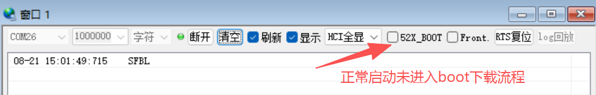
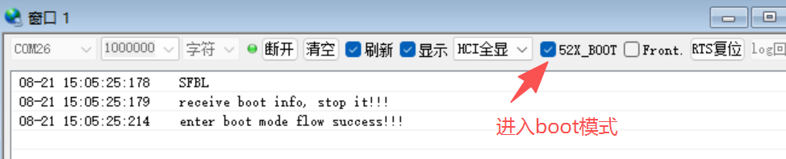
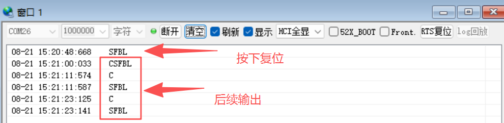
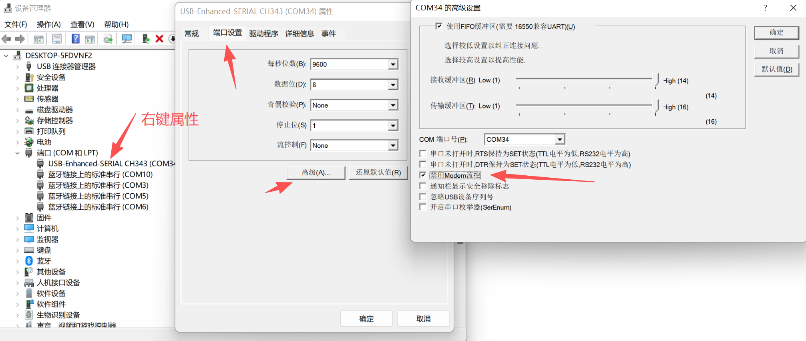
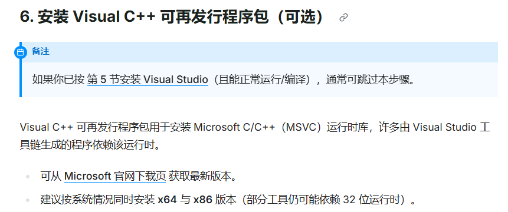

# SF32LB52x 自检指南

:::{attention}
本文档用于SF32LB52x系列芯片的硬件设计自检。在完成硬件设计后，请参照本文档逐项检查，确保硬件设计符合规范要求。
阅读前请确保已完成：
[硬件设计指南](/hardware/SF32LB52B-E-G-J-HW-Application)&nbsp;&nbsp;
[硬件设计自检查列表](<https://downloads.sifli.com/hardware/files/documentation/SF32LB52%20Schematic%26PCB%20checklist_V1.0_20260121.xlsx>)
:::

## 一、基本介绍

本文档为SF32LB52x系列芯片的硬件自检指南，适用于后缀为数字0、3、5、7的芯片（锂电池供电版本）以及后缀为字母B、E、J的芯片（3.3V/1.8V供电版本）。

本文档面向已经完成打样并返板的 SF32LB52x 硬件。重点不是再检查设计方案，而是通过实测点位、示波器、万用表和串口，确认板子在上电、下载、通信和使用过程中是否具备稳定工作能力。先经基本检查，再通过异常FAQ定位问题。

:::{important}
**供电前须确认你所使用的芯片版本对应的供电方式：**

- **锂电池供电版本（0/3/5/7）**：必须接入外部锂电池（VBAT/VCC），否则设备无法正常运行。VBAT 和 VCC 是系统主电源，片内集成充电管理模块，支持 USB 充电。即使使用 USB 供电（VBUS），也需要电池连接在 VBAT 上，系统才能稳定工作。
- **常规供电版本（B/E/J）**：无需外部电池，通过 PVDD 引脚接入 2.97V ~ 3.63V 外部电源即可（52D 为 1.71V ~ 1.98V）。片内无充电管理模块，不支持充电功能。
  :::

### 1.建议工具

- 万用表：用于测量供电电压、测试点电压和短路情况
- 示波器：用于观察时钟波形、纹波和上电瞬态
- USB 数据线、串口工具
- 备用电源、可替换电池或充电器

### 2.测试条件

- 板子上电前先确认无明显短路、无反接、无焊接飞边或桥接
- 测试前先确认测试点是否已经留出并可访问
- 先做静态测量，再做动态上电和通信测试

### 3. 上电前检查

先进行目测和简单电气检查，避免在上电后再去追查明显问题。

- 检查关键器件是否缺件、反装、虚焊或明显短路
- 确认电源输入接口、充电口和电池接口方向正确
- 确认关键测试点（VBUS、VBAT、VCC、PVDD、BUCK_LX、BUCK_FB 等）已留出且可测
- 确认复位、下载和调试引脚没有被外设误拉低或误拉高

### 4. 关键器件选型要求

:::{important}
晶体和电感的参数选型直接影响芯片的启动、运行稳定性和电源质量。参数不符可能导致无法启动、死机、重启或电源异常。请再次确认所用器件型号与参数是否符合以下要求。
:::

#### 48MHz 主时钟晶体

| 参数         | 要求                      | 说明                         | 异常后果                                     |
| :----------- | :------------------------ | :--------------------------- | :------------------------------------------- |
| 频率         | 48MHz                     | 必须精确匹配                 | 无法起振，开启异常                           |
| 封装         | 1612 (1.6×1.2mm) 或 2012 | 确认与 PCB 焊盘匹配          | -                                            |
| 负载电容     | 推荐8.8pF                 | 需与芯片手册推荐值一致       | 频偏大，射频通信异常；频偏过大会直接影响起振 |
| 频率精度     | ±10ppm 或更优            | 精度不足会导致通信波特率偏差 | 精度不足会导致通信波特率偏差                 |
| ESR          | ≤40Ω                    | 过高可能导致不起振           | 无法起振、上电后无时钟输出                   |
| 工作温度范围 | -40°C ~ +85°C           | 需覆盖产品使用环境           | -                                            |

#### 32.768kHz RTC 晶体

| 参数         | 要求                      | 说明                               | 异常后果                           |
| :----------- | :------------------------ | :--------------------------------- | :--------------------------------- |
| 频率         | 32.768kHz                 | 必须精确匹配                       | RTC 计时不准、低功耗唤醒时间偏差大 |
| 封装         | 1610 (1.6×1.0mm) 或 2012 | 确认与 PCB 焊盘匹配                | -                                  |
| 负载电容     | 7pF/11.5pF                | 芯片寄存器只可以修改7pF和11.5pF    | 起振困难、低功耗模式下无法唤醒     |
| 频率精度     | ±20ppm 或更优            | 精度不足会影响 RTC 计时精度        | 影响 RTC 计时精度                  |
| ESR          | ≤50kΩ                   | 过高可能导致不起振或低功耗唤醒异常 | 无法起振、RTC 功能完全失效         |
| 工作温度范围 | -40°C ~ +85°C           | 需覆盖产品使用环境                 | -                                  |

#### DC-DC 电感

| 参数            | 要求                      | 说明                      | 异常后果                                         |
| :-------------- | :------------------------ | :------------------------ | :----------------------------------------------- |
| 电感值          | 4.7μH（典型值）          | 需与芯片手册推荐值一致    | 输出电压纹波增大、效率降低、可能触发欠压保护     |
| 饱和电流        | ≥450mA                   | 需满足峰值负载电流需求    | 负载加重时电感饱和、输出电压跌落、芯片复位或死机 |
| 直流电阻（DCR） | ≤0.4ohm                  | 过高会导致效率降低、发热  | 效率降低、发热严重、电池续航缩短                 |
| 封装            | 0805 或 1008              | 确认与 PCB 焊盘匹配       | -                                                |
| 磁屏蔽          | 屏蔽型优先                | 减少 EMI 干扰             | -                                                |
| 频率特性        | 适用于 1MHz~3MHz 开关频率 | 需匹配芯片 DC-DC 开关频率 | -                                                |

## 二. 供电与上电自检

上电后，应先确认主供电是否正常，再看内部 LDO/PMU 输出是否符合预期。建议按“输入→中间节点→负载端”的顺序测量。

### 2.1 电压检测表

#### 锂电池供电（520/3/5/7）

|   测试点   |             正常工作时             |                       说明                       |
| :---------: | :---------------------------------: | :-----------------------------------------------: |
|    VBUS    |             4.6V ~ 5.5V             |                   USB 充电输入                   |
|    VBAT    |             3.2V ~ 4.7V             |                   电池供电节点                   |
|     VCC     | 3.2V ~ 4.7V (首次上电建议3.8V以上） |                    系统主电源                    |
|    VSYS    |               约 3.3V               |                   射频供电输出                   |
|   BUCK_LX   |              约 1.25V              |                   BUCK电感开关                   |
|   BUCK_FB   |              约 1.25V              |                     BUCK输出                     |
|   VDD_RET   |               约 0.9V               |                    RET LDO输出                    |
|   VDD_RTC   |               约 1.1V               |                   RTC LDO 输出                   |
|  VDD_VOUT1  |               约 1.1V               |                   内部LDO1输出                   |
|  VDD_VOUT2  |               约 0.9V               |                   内部LDO2输出                   |
| VDD18_VOUT |               约 1.8V               |              SIP 供电输出，固定 1.8V              |
| VDD33_VOUT1 |               约 3.3V               | 3.3V LDO 输出1，默认无输出，需软件使能，固定 3.3V |
| VDD33_VOUT2 |               约 3.3V               | 3.3V LDO 输出2，默认无输出，需软件使能，固定 3.3V |
|  AVDD_BRF  |          约 2.97V ~ 3.63V          |                   射频电源输入                   |
| AVDD33_AUD |          约 2.97V ~ 3.63V          |                 3.3V 音频电源输入                 |
|  MIC_BIAS  |           约 1.4V ~ 2.8V           |                麦克风偏置电源输出                |

#### 常规供电（52B/E/J/D）

|   测试点   |                正常工作时                |                       说明                       |
| :--------: | :--------------------------------------: | :-----------------------------------------------: |
|   VBATS   |                    -                    | VBATS是电池电压检测信号，电池电压检测范围0 ~ 4.5V |
|    PVDD    |              2.97V ~ 3.63V              |   系统主电源输入（B/E/J），52D 为 1.71V ~ 1.98V   |
|  BUCK_LX  |                 约 1.25V                 |                   BUCK电感开关                   |
|  BUCK_FB  |                 约 1.25V                 |                     BUCK输出                     |
|  VDD_RET  |                 约 0.9V                 |                    RET LDO输出                    |
|  VDD_RTC  |                 约 1.1V                 |                   RTC LDO 输出                   |
|   VDDIOA   | 1.8V 或 3.3V（52D为1.8V，52B/E/J为3.3V） |         GPIO 电源输入，电压由芯片型号决定         |
|  VDD_SIP  | 1.8V 或 3.3V（52D为1.8V，52B/E/J为3.3V） |         合封存储电源，电压由芯片型号决定         |
| VDD_VOUT1 |                 约 1.1V                 |                   内部LDO1输出                   |
| VDD_VOUT2 |                 约 0.9V                 |                   内部LDO2输出                   |
|   AVDD33   |                 约 3.3V                 |            3.3V 模拟电源输入（B/E/J）            |
|  AVDD_BRF  |             约 2.97V ~ 3.63V             |                   射频电源输入                   |
| AVDD33_AUD |             约 2.97V ~ 3.63V             |                 3.3V 音频电源输入                 |
|  MIC_BIAS  |              约 1.4V ~ 2.8V              |                麦克风偏置电源输出                |

#### 供电自检要点

- 若 VBUS 无电压，优先检查充电口、插座、充电器和保护器件
- 若 VBAT/VCC 低于预期，优先检查电池接口、负载开关和电源路径
- 若 BUCK_LX/BUCK_FB 异常，怀疑 DCDC 相关器件、电感或反馈网络问题
- 若 VDD_VOUT1/VDD_VOUT2 无电压，先确认芯片是否正常上电
- 对于锂电池供电版本，VDD18_VOUT 为固定 1.8V 输出；VDD33_VOUT1/VDD33_VOUT2 为固定 3.3V 输出，默认无输出，需软件使能后才有电压
- 对于锂电池供电版本（0/3/5/7），VBAT/VCC 是系统主电源，**必须接入外部锂电池**才能使设备正常运行。即使通过 USB（VBUS）充电，电池也必须连接在 VBAT 上
- 对于常规供电版本（B/E/J），无需外部电池，通过 PVDD 接入外部电源即可。VDDIOA 和 VDD_SIP 的电压取决于芯片型号：52D 为 1.8V，52B/E/J 为 3.3V，请核对所用芯片型号确认预期电压

### 2.2 Flash 存储供电检测

SF32LB52x支持内部合封Flash/PSRAM和外接Flash存储器，分为锂电池版本和常规供电版本。

#### SF32LB52x 系列（锂电池版本，0/3/5/7后缀）

|           存储类型           |            供电电源            | 是否需要电源开关 | 控制引脚 |              说明              |
| :--------------------------: | :----------------------------: | :--------------: | :------: | :-----------------------------: |
|   内部合封 Flash（520Ux6）   | VDD33_VOUT1 给 VDD18_VOUT 供电 |      不需要      |    -    | 设置VDD18_VOUT内部LDO为关闭状态 |
| 内部合封 PSRAM（523/5/7Ux6） |            内部LDO            |      不需要      |    -    |     VDD18_VOUT外挂电源即可     |
|      外挂 SPI Nor Flash      |      VDD33_VOUT1（3.3V）      |      不需要      |    -    |     直接供电，无需电源开关     |
|     外挂 SPI Nand Flash     |      VDD33_VOUT1（3.3V）      |       需要       |   PA11   |     高电平打开，低电平关闭     |
|      外挂 SD Nand Flash      |      VDD33_VOUT1（3.3V）      |       需要       |   PA11   |     高电平打开，低电平关闭     |

#### SF32LB52X 系列（常规供电版本，B/E/J/D后缀）

|          存储类型          |      供电电源      | 是否需要电源开关 | 控制引脚 |          说明          |
| :-------------------------: | :----------------: | :--------------: | :------: | :--------------------: |
|  内部合封 Flash（52AUx6）  |      VDD_SIP      |       需要       |   PA21   |     必须加电源开关     |
| 内部合封 PSRAM（PVDD=3.3V） | VDD_SIP（内部LDO） |      可不加      |    -    |  内部LDO供电时可不加  |
| 内部合封 PSRAM（PVDD=1.8V） |      VDD_SIP      |       需要       |   PA21   |   PVDD=1.8V时必须加   |
|        外挂存储介质        |   独立于VDD_SIP   |       需要       |   PA21   |    单独增加电源开关    |
|  外挂 ≥32MB SPI Nor Flash  |         -         |       需要       |   PA21   | 退出4BYTE Mode需要断电 |
|  外挂 ≤16MB SPI Nor Flash  |         -         |      不需要      |    -    |        可常供电        |

:::{important}
**Flash供电检测要点：**

1. **VDD_SIP电压**：合封存储电源，常规供电版本范围1.71V~3.63V（52D为1.8V，52B/E/J为3.3V）
2. **PA21/PA11控制信号**：所有启动存储器的电源开关使能脚**必须**使用PA21/PA11控制，高电平打开，低电平关闭
3. **Hibernate模式**：使用Hibernate mode时，VDD_SIP供电要关闭，否则合封存储的I/O上会有漏电风险
4. **大容量Flash**：外接≥32MB SPI Nor Flash时，必须用PA21控制断电，使Flash退出4BYTE Mode
5. **锂电池版本**：VDD33_VOUT1/VDD33_VOUT2默认无输出，需软件使能后才有电压
   :::

### 2.3 电源纹波与上电时序

- 使用示波器观察主供电和模拟供电在上电瞬间是否有明显跌落或尖峰
- 观察上电时序是否存在复位抖动、供电迟滞或瞬间短路现象
- 若板子在上电后立即死机或重启，优先检查电源纹波、复位释放时序和负载开关

## 三. 时钟

### 3.1 48MHz 主时钟

- 用示波器观察 48MHz 晶体对应节点是否存在稳定振荡
- 若无波形，优先检查晶体、负载电容、旁路网络和对应测试点
- 若波形存在但频率明显偏移，优先检查晶体型号、匹配电容和器件安装质量

### 3.2 32.768kHz RTC 时钟

- 用示波器或频率计确认 32.768kHz 时钟是否稳定存在
- 若 RTC 时钟异常，会导致低功耗唤醒、计时和某些外设功能异常
- 若 48MHz 正常而 32K 异常，优先检查 RTC 晶体和其对应匹配网络

## 四. 串口输出

:::{important}

- 本章内容验证芯片启动输出是否正常

sifli串口工具：[SiFli_Trace工具下载](https://downloads.sifli.com/tools/SiFli_Trace/SiFli_Trace_latest.7z) 

:::

### 4.1 串口连接

1.  芯片TX ↔ 串口转换板RX；芯片RX ↔ 串口转换板TX，接反直接无通讯、无打印
2.  串口电平匹配：芯片IO电压 = 转换板电压（1.8V对1.8V，3.3V对3.3V） 

### 4.2 串口通信验证

:::{important}
**即使芯片内没有任何用户程序，SF32LB52x 上电后也会通过 DBG_UART（PA19/TX）自动输出包含 "SFBL" 字样的启动日志。** 这是芯片内部 ROM 固有的行为，可用于验证串口通信链路是否正常工作。
:::

连接串口工具后（波特率 1000000），上电观察串口输出：

- 若能看到包含 **"SFBL"** 字样的输出信息，说明串口通信链路正常（TX/RX 连接正确、电平匹配、波特率正确），即使芯片内尚未烧录任何程序
- 若看不到任何输出，依次排查：
  - 确认 TX/RX 是否接反
  - 确认串口工具电平是否与芯片 IO 电平匹配（3.3V）
  - 确认波特率设置为 1000000
  - 确认 DBG_UART 引脚（PA18/RX、PA19/TX）没有被外设占用或短路
  - 确认芯片供电是否正常、是否已正常上电

### 4.3 复位检测

:::{important}
SF32LB52 芯片的硬件复位可通过 PA34 引脚长按复位或串口工具RTS复位（参考串口自动下载设计部分）。PA34 设计为高电平有效——默认下拉为低，按键按下后电平拉高。这与常见的低电平复位设计不同，自检时需特别注意。
:::

- 上电后确认 PA34 复位引脚默认为低电平（未按下状态），主电源稳定后芯片正常运行
- **长按**复位按键（持续按住约10秒），确认板子能够触发硬件复位并重新启动
- 若长按复位后无响应，优先检查：PA34 是否正确连接按键电路（默认下拉为低，按下拉高）、复位按键是否有效、主供电是否稳定
- 若设备自主反复复位，说明 PA34 电路设计可能有误，请参照硬件设计指南中的开关机按键电路图检查上下拉配置

### 4.4 Bootloader 启动输出（SFBL 、CSFBL、8SFBL）

:::{important}
SF32LB52x 芯片在复位后，内部 BootROM 会通过 DBG_UART（PA19/TX）输出启动标识。根据芯片配置和启动模式不同，会输出 **SFBL** 、**CSFBL**。
:::

#### SFBL — 普通 SiFli BootLoader 启动标识

SFBL 表示芯片内部的普通 BootROM 已经启动，正在执行标准启动流程。

**正常启动流程（BOOT_MODE 未拉高）：**

```text
复位
  |
  +-- 输出 SFBL
  |
  +-- 检查 Flash 中的用户镜像
  |      +-- 镜像有效 → 启动用户程序
  |      +-- 无有效镜像 → 自动进入下载模式
  |
  +-- [进入下载模式时] 输出：
         receive boot info, stop it!!!
         enter boot mode flow success!!!
```



**下载模式启动流程（BOOT_MODE 硬件拉高后复位）：**

```text
复位（BOOT_MODE=H）
  |
  +-- 输出 SFBL
  |
  +-- 等待主机握手（约2秒）
  |      receive boot info, stop it!!!
  |      enter boot mode flow success!!!
  |
  +-- 等待下载命令
```



#### CSFBL — 读flash失败，或CSFBL无固件

**按下复位输出SFBL，等待后输出CSFBL：**



<!-- #### 8SFBL — flash的上拉电阻不对  、**8SFBL**字样

 -->


## 五、固件下载


:::{important}

- 请使用SiFli下载工具下载，出现故障可通过log定位问题

软件下载工具：[Impeller下载](https://downloads.sifli.com/tools/Impeller_COMMON.7z)

Impeller：[使用说明](https://wiki.sifli.com/tools/%E7%83%A7%E5%BD%95%E5%B7%A5%E5%85%B7.html)

:::


## 六. 常见故障FAQ


### 1、串口通信

#### FAQ1：串口复位无打印

A: 建议排查

1、串口TX-RX没有交错连接

2、主电源输入、48M晶体、BUCK电路故障

#### FAQ2：串口复位打印乱码

A: 波特率设置不正确，请统一使用1000000波特率

#### FAQ3:重复打印enter boot mode flow error 1

A:芯片TX正常，RX通路断路/虚焊/电平不匹配

#### FAQ4:上电反复复位/周期性复位

Q：设备反复复位

A: 检测供电，锂电池供电版本需接电池供电。

Q:设备周期性大约10s复位1次

A:确认复位引脚PA34没有被拉高 


#### FAQ5：芯片内有程序，上电复位后仅输出SFBL不正常运行芯片程序

R:串口工具勾选了52X_BOOT 

A：取消勾选串口工具52X_BOOT


#### FAQ5：连接串口后芯片像死机一样不动

R:部分开发板如黄山派、SF32LB52-DevKit-Nano-N16R16 等，通过板载串口的 RTS 管脚复位,在板子重新上电后，第一次通过工具连接串口时会触发板子复位，或者在使用过程中出现打开串口板子关机的情况

A：进入设备管理器->右键端口属性->选择端口设置(高级)->勾选禁用modem流控，sifli_trace工具中有RTS复位功能




#### 下载模式排查要点

- 若只看到 **SFBL** 而看不到后续的 `receive boot info` 和 `enter boot mode flow success`，说明 PC 的 TX 到 MCU 的 RX 链路不通，或未正确启用 SifliTrace 的 BOOT 选项
- 确认 SifliTrace 工具已勾选 BOOT 选项后重启芯片即可触发进入 Boot Mode
- BOOT_MODE 引脚状态决定启动路径：拉高直接进入下载模式，未拉高则先检查 Flash 镜像

### 1、烧录失败

```text

烧录失败 → 第一步判断有无进度条
├─ 无进度条：串口/BOOT/接线类故障（统一处理）
│  ├─ 点击烧录1秒立刻Fail → 串口被占用、COM冲突
│  ├─ Trace完全无任何打印 → 主电源/48M晶体/BUCK/收发接反/未进BOOT
│  ├─ 有BOOT打印，输入help无回复 → 芯片RX/转换板TX硬件断路
│  └─ 驱动加载失败 → 工具芯片型号选错、Flash供电缺失、内核电压异常
├─ 能进BOOT但驱动烧录失败：第三章（仅内核供电、芯片型号校验）
├─ 有进度中途卡住/固定地址报错：第四章（内/外Flash区分、Flash供电、驱动配置、上下拉、ID适配）
├─ 随机概率性失败：第五章（晶体/电感/电源/串口/Flash物料信号）
└─ 99%校验失败：xxx
```

#### 1.1、日志查看

##### 1.1.1 Log日志存放路径

```text

Impeller工具：工具根目录\log\channel\日期\chanx_日期.txt
```

##### 1.1.2 日记关键节点解析速查表


| Log打印节点 |             关键日志内容             |       状态判定       |           说明           |
| :---------: | :----------------------------------: | :------------------: | :-----------------------: |
|   阶段1.1   |       uart COMxx open success       |     串口打开正常     |    串口接线、串口占用    |
|   阶段1.2   |        EnterDebugMode success        |     成功进入BOOT     |   BOOT操作、RX硬件故障   |
|   阶段1.3   |      DownLoadFileRam over: PASS      | 底层烧录驱动加载完成 |    芯片型号、内核供电    |
|   阶段1.4   |     -SiFli Corporation 版本打印     |  芯片内核初始化完成  |   电源、晶体、BUCK电感   |
|   阶段2.1   |            id:0xXXXXXXXX            |  正常识别外部Flash  | 存储上下拉、QSPI/SDIO接线 |
|   阶段2.1   |            id:0x00000000            |   未识别外部Flash   | Flash供电、接线、驱动配置 |
|   阶段2.2   | download_image_simple_thread success |    主镜像写入完成    | Flash供电、接线、驱动配置 |
|   阶段2.3   |        OTP_FACTORY_WRITE_PASS        |    MAC/SN写入成功    |    OTP供电、SN/MAC配置    |
|    末尾    |              FINAL_PASS              |  全部烧录校验通过   |          无故障          |

##### 1.1.3 完整烧录Log样例


```text

workpath: D:\svn_tool\Impeller_x30_2022_m5\Release, 
toolpath: D:\svn_tool\Impeller_x30_2022_m5\Release
cur version 3.8, driver_external/internal_20251030
uart COM19 open success 
//---------------------------- 1.1 到此说明串口正常打开，此处失败跳到第2章节
RAM_PATCH: D:\svn_tool\Impeller_x30_2022_m5\Release\file\ram_patch_52X.bin
SIG_PUB: D:\svn_tool\Impeller_x30_2022_m5\Release\file\sig_pub.der
channel DownLoadUart start 
uart COM19 open success 
EnterDebugMode success: curbaund (1000000)
//---------------------------- 1.2 到此说明串口调试功正常打开，此处失败跳转到第2章节
WriteMemSingle success: 0xf000edf0 0xa05f0003
ReadMemSingle success: 0xf000ee08 0x00000000
WriteMemSingle success: 0xf000ee08 0x00010000
WriteMemSingle success: 0xf000edfc 0x01000001
WriteMemSingle success: 0xf000ed0c 0x05fa0004
ReadMemSingle success: 0xf000edf0 0x02030003
ReadMemSingle success: 0xf000edf0 0x00030003
WriteMemSingle success: 0xf000edfc 0xa05f0003
WriteMemSingle success: 0xf000edfc 0x01000000
[R] PC: 0x000007d4  MSP: 0x20001020

DownLoadFileRam start
use driver: D:\svn_tool\Impeller_x30_2022_m5\Release\file\ram_patch_52X.bin
DownLoadFileRam over: PASS
//---------------------------- 1.3 到此说明烧录驱动下载成功，此处失败跳转到第3章节
WriteMemSingle success: 0x5000202c 0xfffffc00
WriteMemSingle success: 0x50002030 0x00000000
[R] PC: 0x000007d4  MSP: 0x20001020
[R] PC: 0x2005a550  MSP: 0x20043920
[R] BMR: 0x00000001

fid:00000000 mtype:00000000 did:00000000
fid:00000085 mtype:00000020 did:00000018
fid:00000000 mtype:00000000 did:00000000

Serial:c2,Chip:4,Package:3,Rev:3  Reason:00000000
\ | /
- SiFli Corporation
/ | \     build on Oct 30 2025, 2.4.0 build 4f1f8907
2020 - 2022 Copyright by SiFli team
curent ver 20251030, otpbase 0x12000000
psram size:0x800000 addr:0x60000000
//---------------------------- 1.4 到此说明完成所有初始化，进入主函数，此处失败先排查附录A电源
burn_speed 3000000 1000
burn_speed 3000000 1000
OK

//---------------------------- 2 以下是烧录流程
downloadfile: d:\007_watch_eh_lb523_nor_Keil\ota_manager.bin  addr: 0x120ae000  len: 377128 Byte
burn_erase_write 0x120ae000 0x5c128
burn_erase_write 0x120ae000 0x5c128
addr:0x120ae000 base:0x12000000 size:0x1000000 sector:0x1000 page:0x0 id:0x182085
ext_flash -1, g_base_addr 0x0, g_base_size 0x0
//---------------------------- 2.1 检测对应的flash/emmc信息，NOR/NAND flash 要有id号，为0表示未识别到，此处失败跳转到第4章节
RX_WAIT:0 0
[0] run thread 0 addr:0x120ae000 len:0x20000
RX_WAIT:1 1
[1] run thread 1 addr:0x120ce000 len:0x20000
RX_WAIT:0 2
[2] run thread 0 addr:0x120ee000 len:0x1c128
OK
burn_verify 0x120ae000 0x5c128 0x43330e70
burn_verify 0x120ae000 0x5c128 0x43330e70
addr:0x120ae000 base:0x12000000 size:0x1000000 sector:0x1000 page:0x0 id:0x182085
V: 0x43330e70 vs 0x43330e70, TIMR:0xff DCR:0x800000
OK
download_image_simple_thread success 
//---------------------------- 2.2 到此说明该镜像文件烧录完毕，此处失败跳转到第4章节
otpwrite: otp_factory_write 1 c80013140010
otp_factory_write 1 c80013140010
FACTORY_CFG_ID_MAC write ok with 6
OTP_FACTORY_WRITE_PASS
OTP_FACTORY_WRITE_PASS
//---------------------------- 2.3 到此说明写MAC成功，其他磁轭OTP的操作类似，此处烧录失败跳转到第6章节
burn_speed 1000000 1000
burn_speed 1000000 1000
OK
DownLoadUart success 
DownLoadUart() pass
FINAL_PASS
```

<!-- 
#### 1.2、FAQ 烧录无进度

```text

现象简介：点击烧录按钮后1~20s直接弹出Fail，全程无进度加载；1秒内立刻失败，90%原因为串口占用、COM冲突。

快速自检：
1.	释放串口：关闭串口助手、其他烧录软件、虚拟串口工具，设备管理器确认COM未被多程序占用；
2.	统一波特率：全流程强制使用1000000，禁止自定义其他波特率调试。


```


#### 1.3、FAQ 日志


#### FAQ1:烧录


#### FAQ1:日志内容空白、工具启动弹出异常，程序无法启动

Q: 电脑缺失 VC++ 运行库，底层烧录组件加载失败

A: 查阅：[开发环境配置](https://docs.sifli.com/projects/solution/1.get-started/development_env.html) 安装对应版本的[Visual C++ 可再发行程序包]




##### FAQ2:

| 现象                       | 优先检查项                                                                           |
| :------------------------- | :----------------------------------------------------------------------------------- |
| 上电后无任何电压           | 充电口、主电源路径、负载开关、保护器件                                               |
| VBUS 正常但 VCC 异常       | 电池接口、BUCK、反馈网络、PMU 输出                                                   |
| 串口无 SFBL 输出           | TX/RX 是否接反、电平匹配（3.3V）、波特率 1000000、PA18/PA19 是否被占用、供电是否正常 |
| 长按复位无响应             | PA34 按键电路（需高电平有效）、上拉下拉配置、供电是否稳定                            |
| 时钟无波形                 | 晶体、匹配网络、对应测试点、焊接质量                                                 |
| 设备反复重启               | VSYS电压波形是否正确                                                                 |
| 锂电池版本未接电池无法开机 | VBAT/VCC 是否已接入外部锂电池（即使使用 USB 充电也必须连接电池）                     |
| Flash无法识别              | VDD_SIP/VDD33_VOUT1供电、PA21控制信号、Flash焊接质量                                 |
| 程序无法下载到Flash        | PA21控制信号、Flash电源开关、4BYTE Mode退出                                          | -->
